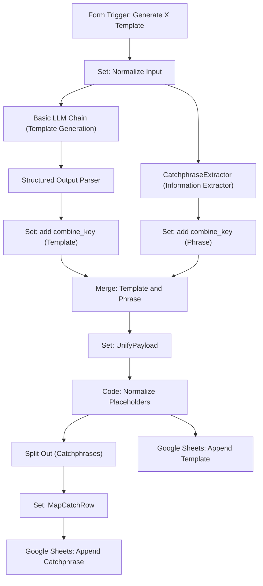

# Generate X Template

## 評価スコア & クイック分析
- **総合スコア**: 3.7 / 5.0
- **判定**: 要改善
- **分析**: 並列処理による効率化は素晴らしいが、エラーハンドリングとモデル指定の柔軟性に欠ける。

## 概要
SNS（主にX）の投稿やアイデアを、再利用可能な「テンプレ」と「キャッチフレーズ」に自動分解・抽象化し、Googleスプレッドシートに保存するワークフロー。

## ワークフロー構成図 (Mermaid)

## 主な機能/ステップ
1. **入力正規化**: フォームからの入力をクリーンアップ。
2. **並列AI処理**: テンプレ構造の抽出と、キャッチフレーズの抽出を同時に実行。
3. **データ統合**: 複数のAI出力を1つのペイロードに統合。
4. **プレースホルダ正規化**: `<<PLACEHOLDER>>` 形式への統一。
5. **スプレッドシート連携**: テンプレ用とキャッチフレーズ用の各シートへ自動保存。

## 改善Todoリスト
- [ ] Google Sheets書き込み時のエラーハンドリング追加
- [ ] LLMノードのリトライ設定有効化
- [ ] モデル名の変数化（最新安定版への対応）

## 設定のポイント
- Google Gemini API (Flash Lite) を使用。
- Google Sheetsの接続にはOAuth2またはサービスアカウントが必要。
