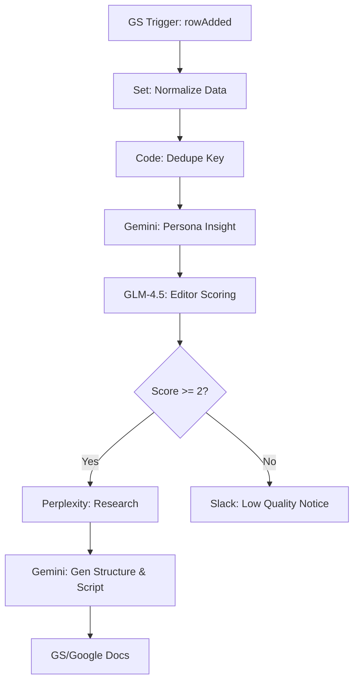

# InstaInput_Collector v4.1 - 分析型コンテンツ収集ワークフロー

このワークフローは、Google Sheetsに入力されたSNSのネタ候補を自動抽出し、ペルソナ視点での分析、編集者視点でのスコアリング、およびPerplexity AIによる詳細調査を行うコンテンツ制作のハブです。

## 📊 ワークフロー評価（by Workfolw-analyze）

- **総合評価**: **3.8 / 5.0**（要改善）
- **判定**: **不合格**
- **評価コメント**:
  設計自体は非常に優秀で、ペルソナの「内面の声」を抽出するロジックなどは独創的です。一方で、エラーハンドリングの不足と、静的なChain構造による柔軟性の欠如が課題として挙げられています。

## 🏗 ワークフロー構成図 (Mermaid)

## 🚀 主な機能
1. **重複排除**: `dedupe_key` を自動生成し、同じURLやネタの重複処理を防止。
2. **ペルソナ・インサイト**: Gemini を使い、ターゲットが「何に悩み、何に感動するか」を徹底的に言語化。
3. **門番（エディター）スコアリング**: GLM-4.5 を使い、一定基準以下のネタはリサーチに回さずフィルタリング。
4. **外部ハイブリッド検索**: Perplexity AI を活用し、最新のトレンドや事実関係を自動補完。

## 🛠 改善のポイント (Todo)
- [ ] AI Agent ノードへの移行（判断の柔軟性向上）
- [ ] エラーハンドリングの共通化（Slack通知の標準化）
- [ ] Human-in-the-Loop（Slack承認ボタン）の導入
- [ ] Obsidian への自動同期実装

## 🖱 設定のポイント
- **Google Sheets**: `Content Idea Input` シートと `Content_ideas` シートの2面構成。
- **Credentials**: Google OAuth2, Perplexity API, OpenRouter (GLM-4.5用) が必要です。
