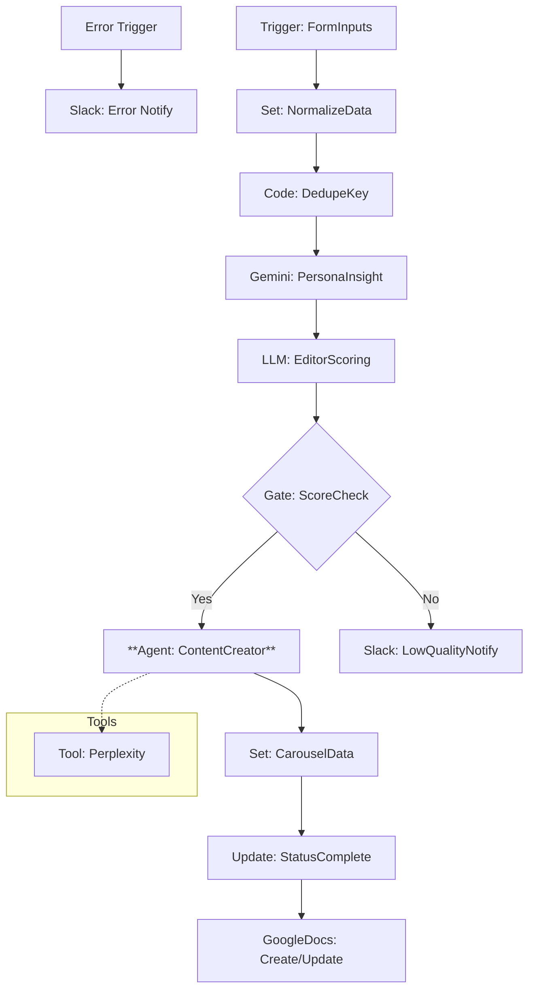

# InstaInput_Collector v4.3 - 分析型コンテンツ収集ワークフロー (Phase 2 Agent版)

このワークフローは、Google Sheetsに入力されたSNSのネタ候補を自動抽出し、ペルソナ視点での分析、編集者視点でのスコアリング、および **AI Agent** による自律的なリサーチと構成作成を行うコンテンツ制作のハブです。

> [!NOTE]
> **Update (v4.3 Phase 2)**: Gemini 2.0 Flash を搭載した AI Agent ノードを導入。必要に応じて Perplexity でリサーチを行いながら、柔軟に構成案を作成できるようになりました。

## 📊 ワークフロー評価（Initial Analysis）

- **総合評価**: **4.2 / 5.0** (Estimated)
- **判定**: **実用段階**
- **改善状況**: 
  - [x] ノード命名規則の統一 (Phase 1)
  - [x] グローバルエラーハンドリングの実装 (Phase 1)
  - [x] **AI Agent化 (Phase 2)**: Linear Chain を廃止し、自律的なAgentへ移行。

## 🏗 ワークフロー構成図 (Mermaid)

## 🚀 主な機能
1. **AI Agent (Gemini 2.0)**: 単なる指示待ちではなく、「情報が足りなければ調べる」「十分なら書く」を自律判断。
2. **重複排除**: `dedupe_key` を自動生成し、同じURLやネタの重複処理を防止。
3. **ペルソナ・インサイト**: Gemini を使い、ターゲットが「何に悩み、何に感動するか」を徹底的に言語化。
4. **門番（エディター）スコアリング**: 複数の視点からネタのポテンシャルを判定。
5. **堅牢な監視**: どこでエラーが発生しても、即座に詳細がSlackに通知される設計。

## 🛠 今後の改善計画 (Next Steps)
- [ ] **Phase 3**: Human-in-the-Loop（Slack承認ボタン）の導入
- [ ] **Phase 3**: Obsidian への自動同期実装

## 🖱 設定のポイント
- **Google Sheets**: `Content Idea Input` シートと `Content_ideas` シートの2面構成。
- **Credentials**: Google OAuth2, Perplexity API, Google Gemini API, Slack API が必要です。
- **Error Channel**: Slack通知を受け取るチャンネルIDを設定してください。
