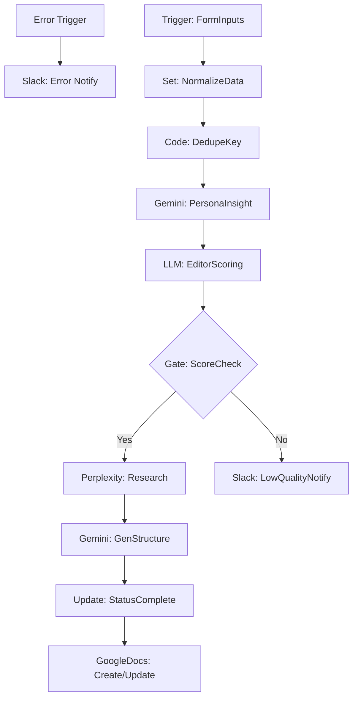

# InstaInput_Collector v4.2 - 分析型コンテンツ収集ワークフロー (Phase 1 改善版)

このワークフローは、Google Sheetsに入力されたSNSのネタ候補を自動抽出し、ペルソナ視点での分析、編集者視点でのスコアリング、およびPerplexity AIによる詳細調査を行うコンテンツ制作のハブです。

> [!NOTE]
> **Update (v4.2 Phase 1)**: 全ノードのリネーム（可読性向上）と、ワークフロー全体のグローバルエラーハンドリング（Error Trigger + Slack）を実装しました。

## 📊 ワークフロー評価（Initial Analysis）

- **総合評価**: **3.8 / 5.0**
- **判定**: **要改善**
- **改善状況**: 
  - [x] ノード命名規則の統一
  - [x] グローバルエラーハンドリングの実装

## 🏗 ワークフロー構成図 (Mermaid)

## 🚀 主な機能
1. **重複排除**: `dedupe_key` を自動生成し、同じURLやネタの重複処理を防止。
2. **ペルソナ・インサイト**: Gemini を使い、ターゲットが「何に悩み、何に感動するか」を徹底的に言語化。
3. **門番（エディター）スコアリング**: 複数の視点からネタのポテンシャルを判定。
4. **外部ハイブリッド検索**: Perplexity AI を活用し、最新のトレンドや事実関係を自動補完。
5. **堅牢な監視**: どこでエラーが発生しても、即座に詳細がSlackに通知される設計。

## 🛠 今後の改善計画 (Next Steps)
- [ ] **Phase 2**: AI Agent ノードへの移行（Gemini 2.0 Flash によるツール利用型リサーチ）
- [ ] **Phase 3**: Human-in-the-Loop（Slack承認ボタン）の導入
- [ ] **Phase 3**: Obsidian への自動同期実装

## 🖱 設定のポイント
- **Google Sheets**: `Content Idea Input` シートと `Content_ideas` シートの2面構成。
- **Credentials**: Google OAuth2, Perplexity API, Google Gemini API, Slack API が必要です。
- **Error Channel**: Slack通知を受け取るチャンネルIDを設定してください。
