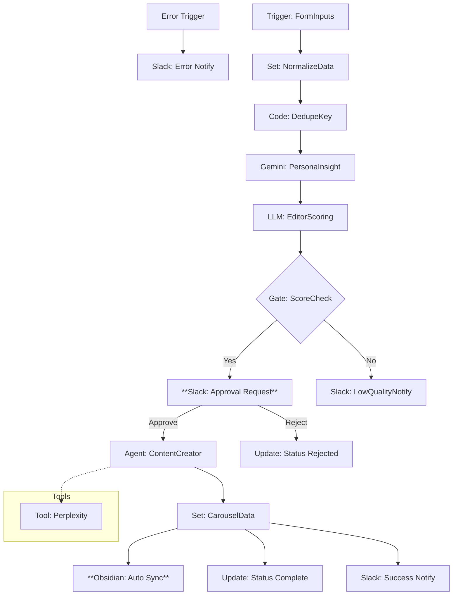

# InstaInput_Collector v4.4 - 分析型コンテンツ収集ワークフロー (Phase 3 HITL & Sync版)

このワークフローは、Google Sheetsに入力されたSNSのネタ候補を自動抽出し、ペルソナ視点での分析、編集者視点でのスコアリング、**Slackでの有人承認 (Human-in-the-Loop)**、および **AI Agent** による制作と **Obsidian への自動同期** を行う、自律型コンテンツ制作パイプラインです。

> [!NOTE]
> **Update (v4.4 Phase 3)**: ヒューマン・エラーを防ぐためのSlack承認機能と、ナレッジ蓄積のための Obsidian 同期機能を実装しました。

## 📊 ワークフロー評価（Initial Analysis）

- **総合評価**: **4.5 / 5.0** (Estimated)
- **判定**: **実用・効率化段階**
- **改善状況**: 
  - [x] ノード命名規則の統一 (Phase 1)
  - [x] グローバルエラーハンドリングの実装 (Phase 1)
  - [x] **AI Agent化 (Phase 2)**: Gemini 2.0 Flash による自律リサーチ。
  - [x] **Human-in-the-Loop (Phase 3)**: Slackによる承認フローの導入。
  - [x] **ナレッジ同期 (Phase 3)**: Obsidianへの自動バックアップ。

## 🏗 ワークフロー構成図 (Mermaid)

## 🚀 主な機能
1. **Slack承認フロー**: AIの分析結果をSlackで確認。手動で「承認」ボタンを押した時のみ、Agentがリサーチと本文執筆を開始します。
2. **Obsidian同期**: 生成されたコンテンツの構成案を、ローカルのObsidian Vault (`content/instainput-outputs/`) へ自動保存。
3. **AI Agent (Gemini 2.0)**: 情報を自律的に補完し、高品質な構成案を作成。
4. **堅牢な監視**: 全工程でエラーをSlack通知し、パイプラインの停止を防止。

## 🛠 今後の改善計画 (Next Steps)
- [ ] **Phase 4**: 複数プラットフォーム（Threads/X）への同時最適化
- [ ] **Phase 4**: 画像生成AI（DALL-E 3等）との連携によるバナー案自動作成

## 🖱 設定のポイント
- **Obsidian**: Local REST API プラグインまたはファイルシステムへの書き込み権限が必要です。
- **Slack**: インタラクティブボタンを有効にしたSlack Appの設定が必要です。
- **Google Sheets**: `Content_ideas` シートに `rejected` ステータスが追加されています。
