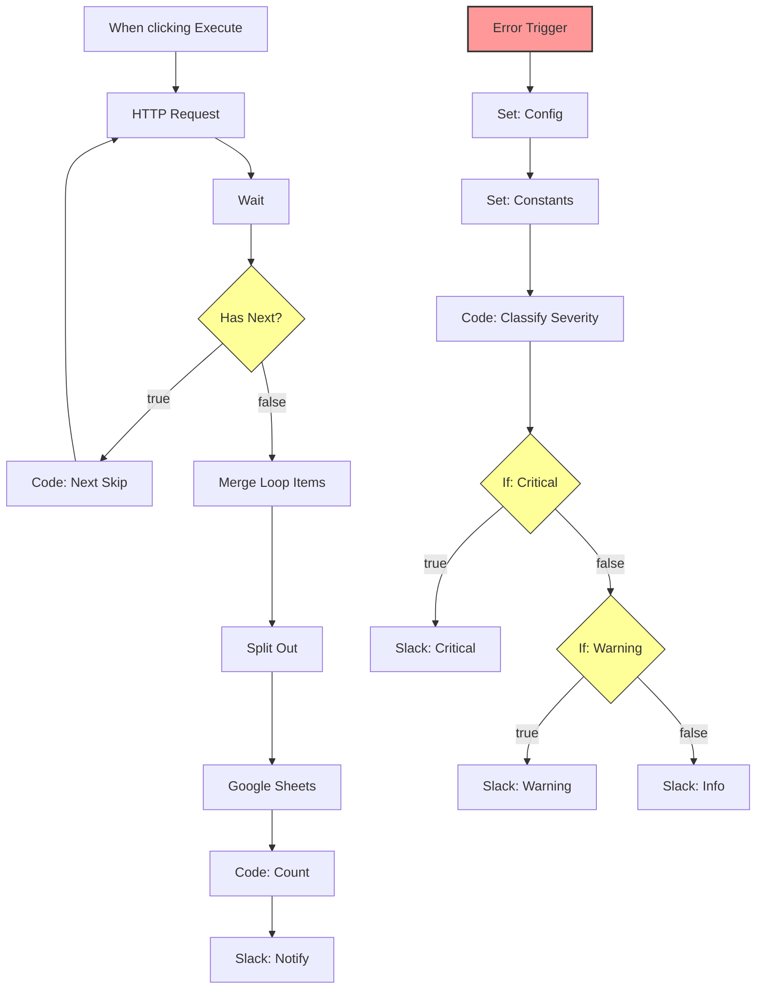

# Shopify Pagination & Error Handling Workflow

Shopify APIからページネーション（カーソルベース）を使用して以前の商品データを取得し、Google Sheetsに保存するn8nワークフローです。
高度なエラーハンドリング（Slack通知の重要度分類）を含んでいます。

## 🧩 アーキテクチャ (Architecture)

## ⚙️ セットアップ (Setup)

### 必須クレデンシャル
以下のクレデンシャルをn8nに設定してください：
- **Google Sheets OAuth2 API**: `Google Sheets account`
- **Slack API**: `Slack account`

### 設定値 (Config Node)
`config1` ノードで以下の値を環境に合わせて変更してください：
- `config.appUrl`: n8nインスタンスのURL (例: `http://localhost:5678`)
- `config.slack.channel.critical`: 重大エラー通知用チャンネル名
- `config.slack.channel.warning`: 警告通知用チャンネル名
- `config.slack.channel.info`: 情報通知用チャンネル名

## 🛡️ エラーハンドリング
`ErrorTrigger` ノードにより、ワークフロー全体の障害をキャッチします。
エラーの内容に基づいて、自動的に重要度を判定します：
- **Critical (🔥)**: Authエラー、401/403、リトライ回数超過など。
- **Warning (⚠️)**: タイムアウト、5xxエラー、レート制限など。
- **Info (ℹ️)**: その他。

## ⚠️ 注意事項 (Limitations)
- **メモリ使用量**: このワークフローは全データをメモリに保持してから処理する「Merge Loop Items」パターンを使用しています。データ量が非常に多い場合（数万件〜）、メモリ不足になる可能性があります。
- **レート制限**: Google Sheetsへの書き込みはバッチ処理されていないため、大量データの書き込み時にAPI制限にかかる可能性があります。大規模データの場合は `Split In Batches` ノードの追加を検討してください。
