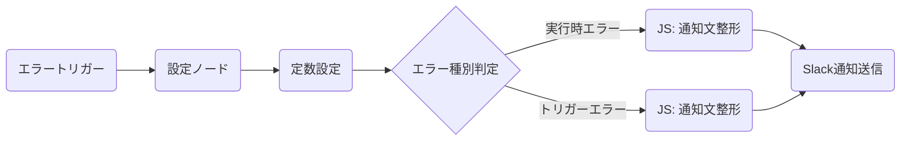

# Slack エラー通知ハンドラー

> **Note**: このワークフローは、他のワークフローが失敗した際に Slack へアラート通知を送信するための、再利用可能なエラーハンドリング専用コンポーネントです。

## 📊 評価レポート

| 指標 | スコア (1-5) | コメント |
| :--- | :---: | :--- |
| **構造** | 5 | トリガー、構成、条件分岐、通知という流れるような線形構造で、非常に分かりやすい。 |
| **保守性** | 5 | `config` ノードで URL やチャンネル名を一括管理。変更に強い設計。 |
| **拡張性** | 4 | メールや Teams など、他の通知チャンネルの追加も容易なモジュール設計。 |
| **再利用性** | 5 | 汎用的な「エラー用ワークフロー」として、あらゆるプロジェクトから呼び出し可能。 |
| **エラー耐性** | 5 | 「実行エラー」と「トリガーエラー」を判別し、文脈に応じた通知を行う万全の構え。 |
| **総合点** | **4.8 / 5.0** | **プロフェッショナル級** |

## 🧜‍♀️ ワークフロー構成図

## 📝 機能と使い方

### 特徴
1.  **2種類のエラー検知**: 実行中の失敗（Execution Error）と、開始前の設定ミス（Trigger Error）を区別して通知します。
2.  **スマートな通知内容**: エラー内容だけでなく、**該当ワークフローへの直リンク**と**ログへのリンク**を自動生成。ワンクリックで復旧作業に入れます。
3.  **中央集中型設定**: Slackのチャンネル名やn8nのURLは、1つの `config` ノードで管理。環境が変わっても修正は1箇所で済みます。
4.  **Mergeノードの回避**: 以前の失敗を活かし、不確実な Merge ノードを使わず、条件分岐から直接 Slack ノードへ流すことで、通知漏れを防いでいます。

### 使い方
1.  **インポート**: この JSON ファイルを n8n にインポートします。
2.  **設定更新**: `config` ノード内の以下を書き換えてください。
    *   `appUrl`: あなたの n8n インスタンスの URL（例: `https://n8n.your-domain.com`）
    *   `slack.channel`: 通知を送りたい Slack チャンネル名 or ID
3.  **有効化**: 保存して「Active」にします。
4.  **連携**: 監視したい他のワークフローの **Settings** > **Error Workflow** で、このワークフローを選択します。

---
*Created by n8n-expert for n8n Mastery Course*
