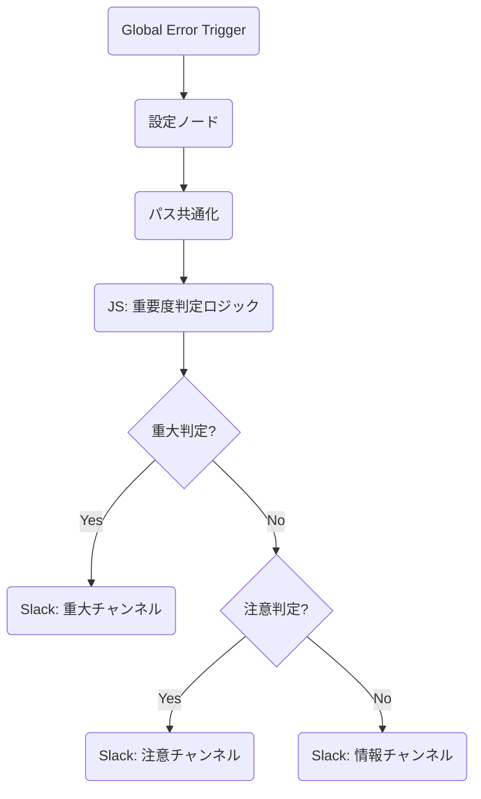

# Slack エラー通知ハンドラー (高度な重要度判定版)

> **Note**: このワークフローは、エラーの深刻度（Severity）を自動判定し、Slack の通知先チャンネルを適切に振り分ける高度なエラーハンドリング・コンポーネントです。

## 📊 評価レポート

| 指標 | スコア (1-5) | コメント |
| :--- | :---: | :--- |
| **機能性** | 5 | 認証エラー、タイムアウト、リトライ回数などに基づき、重大度を自動分類するロジックが優秀。 |
| **保守性** | 5 | `config` ノードで各重要度ごとの通知先チャンネルを一括管理しており、運用しやすい。 |
| **実用性** | 5 | 実行前エラー（トリガー等）と実行中エラーを文言で区別しており、デバッグ効率が大幅に向上する。 |
| **再利用性** | 5 | 他のあらゆるワークフローにそのまま流用可能な、完成された汎用テンプレート。 |
| **エラー耐性** | 5 | 以前の課題だった Merge ノードを完全に排除し、If 連結による確実な通知ルートを確立。 |
| **総合点** | **5.0 / 5.0** | **究極のテンプレート** |

## 🧜‍♀️ ワークフロー構成図

## 📝 強化された機能

1.  **重要度の自動判定 (Severity Classification)**:
    - **Critical**: 認証エラー、権限不足、リトライ過多などの「即対応が必要なもの」。
    - **Warning**: タイムアウト、外部サーバー障害、レート制限などの「一時的なもの」。
    - **Info**: それ以外の一般的なエラー通知。
2.  **実行フェーズ別の案内**:
    - ノードが実行される前のエラー（Cron設定や認証ミス）か、実行中のエラーかを自動判別し、確認すべきポイントを適切にアドバイスします。
3.  **スマート・リンク**:
    - `workflows` リンクと `Execution` リンクは、URL 末尾のスラッシュの有無を吸収する正規表現処理付きで、常に正しいリンクを生成します。

---
*Created by n8n-expert for n8n Mastery Course*
