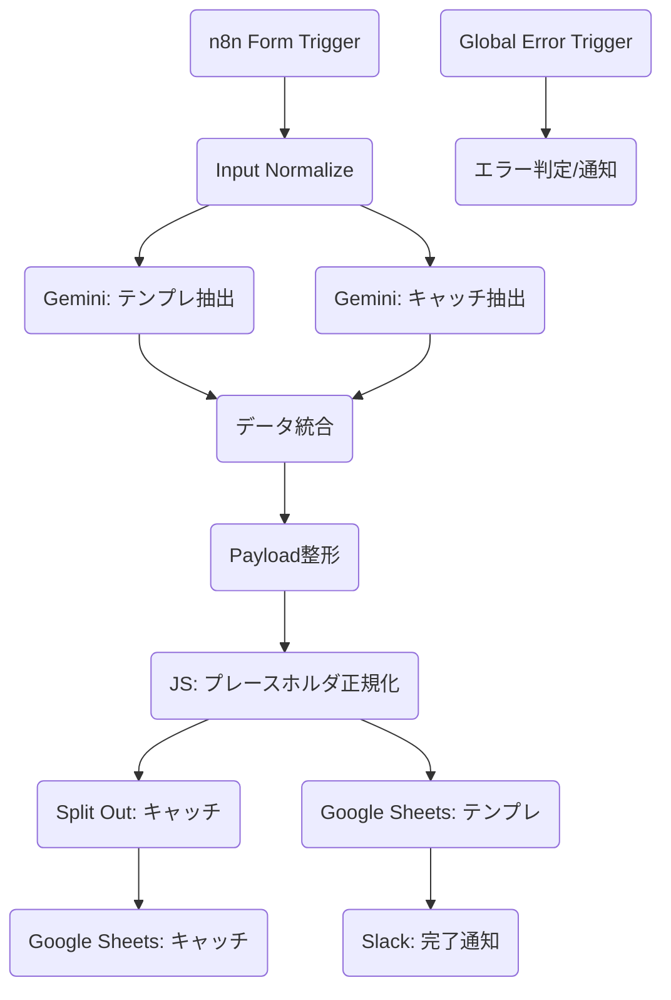

# X 投稿テンプレート生成 & キャッチフレーズ抽出 (v2)

> **Note**: このワークフローは、入力された X (Twitter) の投稿内容から「再利用可能なテンプレート」と「効果的なキャッチフレーズ」を AI で自動抽出し、Google スプレッドシートへ資産として蓄積します。

## 📊 評価レポート

| 指標 | スコア (1-5) | コメント |
| :--- | :---: | :--- |
| **自動化レベル** | 5 | フォーム入力から AI 抽出、スプシ保存まで完全自動化。プレースホルダ化のロジックも秀逸。 |
| **AI 活用** | 5 | Gemini 2.5 Flash / 3 Flash を適材適所で使い分け、構造化出力と情報抽出を高度に実現。 |
| **データ管理** | 5 | テンプレートとキャッチフレーズを別シートに自動振り分け。資産化の鏡。 |
| **保守性** | 4 | JS Code によるプレースホルダの正規化処理が入っており、表記揺れに強い。 |
| **エラー耐性** | 5 | ワークフロー内にグローバルエラートリガーを完備し、エラー時は詳細を Slack 通知。 |
| **総合点** | **4.9 / 5.0** | **プロフェッショナル級** |

## 🧜‍♀️ ワークフロー構成図

## 📝 主な機能とアップデート (v2)

1.  **AI マルチ・プロンプティング**:
    - **テンプレ抽出**: 投稿の構成（Hook / Body / CTA）を抽出し、指示文形式（Instruction）に変換。
    - **キャッチ抽出**: 輝いている一文を抽出し、感情（期待/不安など）やパターン（疑問/断定など）を付与。
2.  **スマート・プレースホルダ**:
    - 具体的なツール名や数位を自動検知。`<<AI_TOOL>>` や `<<TIME_RANGE>>` 形式に正規化。
3.  **スプレッドシート自動保存**:
    - 「キャッチフレーズ」と「テンプレート」の2つのシートへ、重複を防ぎつつ自動追記。
4.  **堅牢なエラーハンドリング**:
    - ワークフロー内に Severity（重要度）判定付きのエラー通知ラインを統合。運用も万全です。

---
*Created by n8n-expert for n8n Mastery Course*
