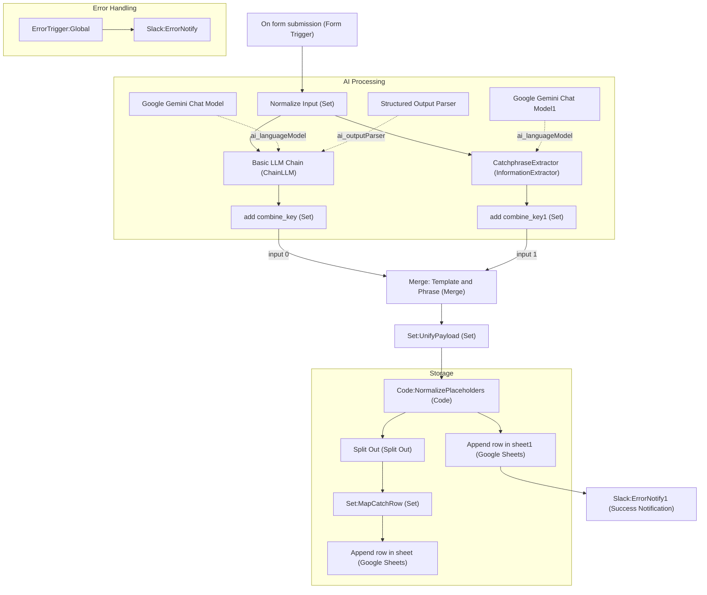

# X Template Generator Workflow

フォームから入力されたX（旧Twitter）の投稿やアイデアを解析し、再利用可能な「テンプレート」と「キャッチフレーズ」を抽出してGoogleスプレッドシートに保存するn8nワークフローです。

## ワークフローの目的
- 優れた投稿の構造を抽出し、テンプレート資産として蓄積する。
- 汎用性の高いキャッチフレーズをプレースホルダ化して抽出し、制作スピードを向上させる。

## システム構成
- **トリガー**: n8n Form Trigger
- **AI処理**: Google Gemini (1.5 Flash推奨)
- **保存先**: Google Sheets (テンプレート用とキャッチフレーズ用の2シート)
- **通知**: Slack (成功時およびエラー時)

## ワークフロー図 (Mermaid)

## 評価結果 (Quality Score)
- **総合点: 4.1 / 5.0 (PASS)**
- **構造 (4.5)**: 並列処理とマージの設計が非常に効率的。
- **再利用性 (4.5)**: JSノードによるプレースホルダの正規化が優秀。

## 改善のためのTodo
- [ ] AIノードのモデル名を `gemini-1.5-flash` に修正
- [ ] Slack通知メッセージに `{{ $execution.url }}` を追加
- [ ] Google Sheetsノードにリトライ設定 (`Retry On Fail`) を追加
