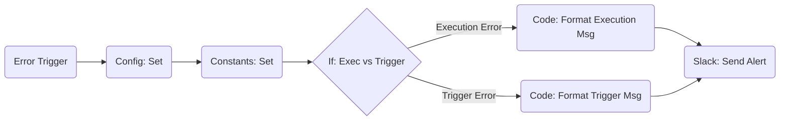

# Slack Error Notification Handler

> **Note**: This workflow is a reusable error handling component designed to send alert notifications to Slack when other workflows fail.

## 📊 Evaluation Report

| Metric | Score (1-5) | Comment |
| :--- | :---: | :--- |
| **Structure** | 5 | Clean linear flow with clear logic separation (Trigger -> Config -> If -> Slack). |
| **Maintainability** | 5 | Uses `config` node to centralize settings (appUrl, channel). Excellent separation of concerns. |
| **Scalability** | 4 | Can be easily extended to support other notification channels (Email, Teams) due to modular design. |
| **Reusability** | 5 | Designed as a generic "Error Workflow" that can be attached to any number of parent workflows. |
| **Error Tolerance** | 5 | Handles both 'Execution Error' and 'Trigger Error' distinctly, providing context-aware alerts. |
| **Total Score** | **4.8 / 5.0** | **Excellent (Professional Grade)** |

## 🧜‍♀️ Workflow Diagram

## 📝 Features & Usage

### Key Capabilities
1.  **Dual Error Detection**: Distinguishes between runtime errors (Execution Error) and configuration/start-up errors (Trigger Error).
2.  **Smart Formatting**: Generates clean, actionable Slack messages with direct links to the failing workflow and execution log.
3.  **Centralized Config**: Slack channel name and n8n instance URL are managed in a single `config` node.
4.  **No Merge Node**: Avoids the "0 items" trap by using direct paths from the `If` node to the `Slack` node.

### How to Use
1.  **Import**: Import this JSON into your n8n instance.
2.  **Configure**: Update the `config` node with your:
    *   `appUrl`: Your n8n instance URL (e.g., `http://localhost:5678` or `https://n8n.example.com`).
    *   `slack.channel`: The channel name/ID where you want alerts.
3.  **Activate**: Save and activate this workflow.
4.  **Attach**: In any other workflow, go to **Settings** -> **Error Workflow** and select `Slack Error Notification Handler`.

## 🛠️ Configuration Details
*   **Error Trigger**: Catches all errors from calling workflows.
*   **Code Nodes**: Uses JavaScript to construct the Slack message payload dynamically based on the error context (`$execution.error.message`, `$execution.url`).
*   **Slack Node**: Sends the pre-formatted text block.

---
*Created by n8n-expert for n8n Mastery Course*
