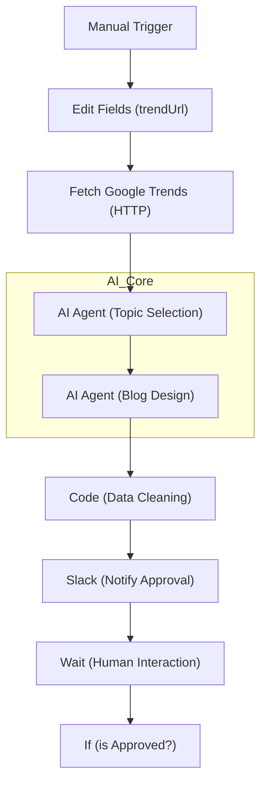

# Trend Content Factory

Google TrendsのRSSフィードから最新の話題をAIが選定し、ブログ記事の構成案を作成、Slackで承認を求める半自動化ワークフローです。

## 概要
このワークフローは、トレンド情報の収集からコンテンツ企画までのプロセスを効率化します。AI Agentがトレンドの重要性を判断し、人間がSlack上で最終的な「GO/NO-GO」を判断するハイブリッドな設計が特徴です。

### 📊 ワークフロー評価
- **総合スコア**: 3.9 / 5.0
- **分析**: 人間による物理的確認工程（Wait）がある実運用レベルのフロー。エラーハンドリングと命名規則の整理でさらに品質が向上します。

### 📋 改善Todo
- [ ] 各ノードを役割名に変更（例: AI Agent -> Topic_Selector）
- [ ] HTTP Request のエラーハンドリング追加
- [ ] AIの空レスポンスに対するチェック分岐を追加
- [ ] 却下(Reject)時のログ記録フローの実装

## ワークフロー構成図 (Mermaid)

## 主な機能/ステップ
1. **Trend Fetch**: Google TrendsのRSSを取得します。
2. **AI Curator**: 取得したトレンドから、バイラル性が高くターゲットに刺さるネタを1つ選定します。
3. **AI Content Writer**: 選定されたネタに基づき、SEOを意識した詳細なブログ構成案を生成します。
4. **Data Formatter (Code)**: 生成されたデータをSlackで安全に表示できる形式に変換します。
5. **Human Approval (Slack & Wait)**: Slackに通知を送り、人間が「承認」ボタンを押すまで待機します。
6. **Conditional Branching (If)**: 承認結果に基づいて後の処理（保存や投稿など）へと分岐します。

## 設定のポイント
- **AI Model**: OpenRouter経由で最新のLLM（GLM-4.5-air等）を使用するように設定されています。
- **Slack Interaction**: SlackのInteractive Componentsを使用しているため、n8nのWebhook URLがSlack App側で正しく設定されている必要があります。
- **Wait Node**: ワークフローの実行はこのノードで一旦停止し、外部（Slack）からのレスポンスを待ちます。
