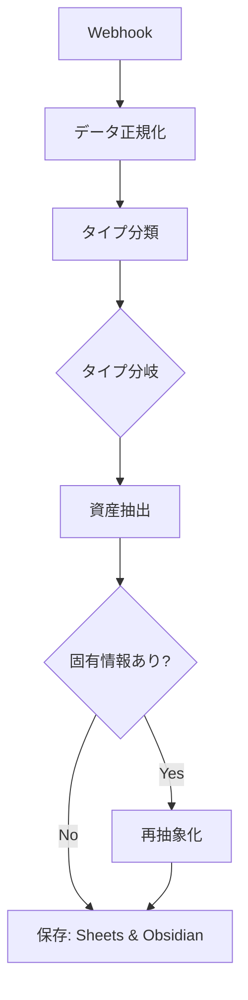

# X Post Asset Extractor (n8n Workflow)

## 概要
X（旧Twitter）の投稿をWebhookで受け取り、自動的に「再利用可能な資産」へと変換するワークフローです。
単なるアーカイブではなく、将来の投稿で使い回せる「構造（テンプレ）」と「フック（キャッチコピー）」を抽出します。

## 主な機能
1.  **投稿タイプ分類**: 投稿を5つの型（主張、手順、問題解決、ストーリー、リスト）に自動分類。
2.  **テンプレ抽出**: 投稿から具体的な固有名詞を抜き、穴埋め形式の構造を作成。
3.  **キャッチ抽出**: 文脈に依存しない、強力なキャッチコピー・フレーズを抽出。
4.  **強制再抽象化**: 固有情報（人名・数値など）が残っている場合、AIが自動で再度抽象化。
5.  **デュアル保存**: Google Sheets（DB用）と Obsidian（閲覧・ストック用）に同時保存。

## セットアップ
1.  `INSERT_YOUR_SHEET_ID` を自身の Google Sheets ID に差し替えてください。
2.  Obsidianの保存先パス `/files/obsidian/n8n/資産抽出/` は、Dockerボリュームマウント設定に合わせて調整してください。
3.  AIノードには `Gemini 2.0 Flash` を使用しています。

## ワークフロー構造

